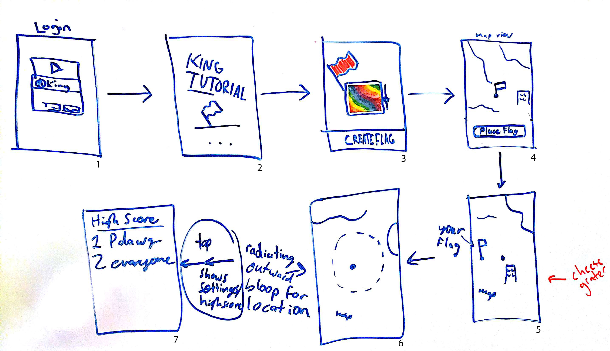

# Bloops
An Android app that lets you play the largest game of capture the flag.

#### Sam Myers, Philip Seger, Danny Wolf

### Wirefram explanation:

1. Login screen, which is only visible on the initial launch of the app. The user logins to Google Play Games (which we then use their username as their identifier).
2. After login on first launch, a tutorial is displayed that gives an overview of the core game mechanics and how to interact with our application. This tutorial is similar to other app tutorials, in that it is a cardview that the user can swipe through.
3. The user can then customize their flag. This can either be through choosing a color or more advanced depending on what stretch goals we complete. The _Create Flag_ button finalizes their flag and brings them to the map.
4. At the map screen, if the user is new to the game or if someone else captured their flag, they are able to place their flag. The user is locked at the center of the map view, which is pointing north, and when the user moves the map moves under them. This means that when the user is happy with a location, they hold the _Place Flag_ or the flag itself to place their flag. Then, the screen transitions to a blank map view with the user locked in the center as before.
5. This is the main screen when a user jumps in to the app to play and they already have dropped their flag somewhere. The map view scrolls under them and their location is center on the map. The blue dot bloops out (think sonar, but all directions), drawing an animation over the map. As they get closer to another user's flag, the bloops increase in frequency until they capture that other user's flag, which shows a visual of the flag and their score goes up by however many flags that other user had (minimum score up by 1).
6. Animation of the visual bloop radiating out from the center of the map. Tapping on the map view here opens the settins/high score screens as an overlay.
7. The settings/high score screen functions as a way for the user to delete their data/logout, change their flag type and color, and also shows the weekly/all time high score values. Tapping out of this screen will return to the map view.

### Class diagram:

[WIP]